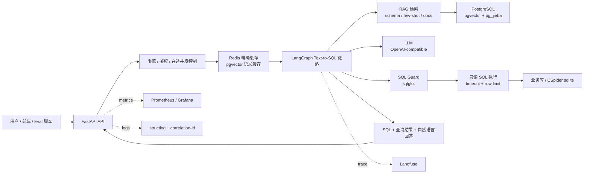
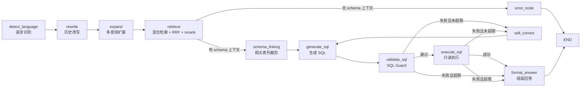

# QueryForge — 生产级通用 Text-to-SQL（LangGraph + RAG）

把自然语言问题转成**安全、可执行**的 SQL，并返回自然语言回答。链路可控、可追踪、可监控，
内置限流、容错、缓存与自纠错，面向生产；仓库提供开环压测脚本，实际 QPS 需按模型、数据库和部署资源复测。

## 项目定位

QueryForge 是一个从真实业务 Text-to-SQL 实践中抽象、脱敏出来的通用工程框架，重点不是做一个能跑通的 demo，而是把 Text-to-SQL 落地时最容易被忽略的问题系统化：

- **准确率验证**：基于 CSpider 做 Execution Accuracy、公平 A/B、RAG 消融、schema 风格对照。
- **RAG 工程化**：schema / few-shot / docs 三类语料，支持向量检索、关键词检索、RRF、rerank。
- **SQL 安全**：SQL Guard 只允许单条 SELECT，拦截 DDL/DML，自动 LIMIT，配合只读执行与超时控制。
- **生产韧性**：限流、全局并发控制、LLM 并发闸门、熔断、重试、缓存、Docker 部署。
- **可观测性**：Langfuse trace、Prometheus/Grafana 指标、结构化日志、correlation-id。
- **多轮应用**：JWT 登录、会话列表、消息持久化、多轮历史上下文。

适合用来研究或二次开发：

- 企业内部数据问答 / BI Copilot
- Text-to-SQL 工程化落地
- LangGraph + RAG 生产链路
- SQL Guard 与数据库只读执行
- LLM 应用的评测、限流、监控和容错

## 文章系列

我把项目设计、实验过程和阶段结论整理成了三篇文章：

1. [从真实业务实践中脱敏开源：我做了一个生产级 Text-to-SQL 框架](https://zhuanlan.zhihu.com/p/2055649184003389206)
2. [Text-to-SQL 里 RAG 到底有没有用？我做了一组 CSpider 消融实验](https://zhuanlan.zhihu.com/p/2055697640805883997)
3. [生产级 Text-to-SQL，最容易被忽略的不是生成 SQL，而是 SQL 安全](https://zhuanlan.zhihu.com/p/2055705543159854415)

## 阶段实验结论

| 实验 | 数据 | 结论 |
|------|------|------|
| 公平 A/B | `concert_singer · 45`：RAG retry `0.889` vs noRAG retry `0.800` | 单库场景 RAG 有明显收益 |
| 公平 A/B | `cre_Doc_Template_Mgt · 50`：RAG retry `0.940` vs noRAG retry `0.880` | 中等难度问题收益更明显 |
| 公平 A/B | `ALL · 100`：RAG retry `0.760` vs noRAG retry `0.780` | 跨库小样本下 RAG 不一定稳定提升 |
| RAG 消融 | `ALL · 100`：schema_fewshot `0.790`，full_rag `0.750` | few-shot 是当前最稳定收益来源，full RAG 不一定最优 |
| Schema 描述增强 | `concert_singer` 小幅提升，`cre_Doc_Template_Mgt` 下降 | schema 描述不能盲目上线，需要按库 A/B |

## 架构总览



LangGraph 主链路（融合 RAG 设计图 + text-to-SQL 生产要素）：



更详细的架构说明见 [docs/ARCHITECTURE.md](docs/ARCHITECTURE.md)。

## 关键能力（生产"该有的"）

| 维度 | 实现 |
|------|------|
| RAG 检索 | pgvector 向量 + 关键词全文（pg_jieba / Elasticsearch 可切换），RRF 融合，Qwen gte-rerank 重排，多查询扩展 |
| 文档入库 | 切块 + LLM 按页 summary（metadata 存 chunk_id 集合）+ summary 展开检索 |
| Schema linking | 由 RAG 召回裁剪相关表/列，降 token 提准确率 |
| SQL 安全 | sqlglot 解析，仅允许单条 SELECT，禁 DDL/DML，自动注入 LIMIT |
| 执行沙箱 | 只读连接 + 超时 + 行数上限（sqlite / postgres） |
| 自纠错 | 校验/执行失败回灌错误重生成，最多 `SQL_MAX_RETRY` 次 |
| 并发/容错 | 全异步、连接池、tenacity 重试、熔断器、slowapi 限流（Redis 分布式） |
| 缓存 | 双层：Redis 精确缓存 + pgvector 语义近似缓存（同义问命中，默认关闭，避免近似误命中） |
| 可观测 | Langfuse 链路追踪 + Prometheus/Grafana 指标 + structlog + correlation-id |
| 评测 | ragas（检索质量）+ Execution Accuracy（CSpider gold 对比，按难度分桶） |

## 数据集说明

本项目的 Text-to-SQL 准确率实验使用 [taolusi/chisp](https://github.com/taolusi/chisp) 提供的 CSpider 数据集。CSpider 是中文跨领域 Text-to-SQL benchmark，包含自然语言问题、数据库 schema、SQLite 数据库和 gold SQL。

本仓库不内置 CSpider 原始数据。请按原项目许可与说明自行下载，并在 `.env` 中配置：

```bash
CSPIDER_ROOT=/path/to/CSpider
CSPIDER_DB_DIR=/path/to/CSpider/database
```

## 快速开始

```bash
# 1. 依赖
make install                      # pip install -e ".[eval,dev]"
cp .env.example .env              # 填入 DashScope/OpenAI-compatible key、Langfuse key、CSpider 路径

# 2. 基础设施（postgres+pgvector+pg_jieba / redis / prometheus / grafana）
make infra-up

# 3. 建表与扩展
make migrate

# 4. 灌入 CSpider schema 与 few-shot
make ingest
# 可选：先生成可审核的表说明 JSON，再重灌带表语义描述的 schema_doc
python -m eval.generate_schema_descriptions --db concert_singer --output eval/artifacts/schema_descriptions.json
python -m eval.ingest_cspider --schema-style enriched --schema-descriptions eval/artifacts/schema_descriptions.json --replace-schemas --skip-fewshots

# 5. 启动 API
make run                          # http://localhost:8000/docs

# 6. 试一条（无鉴权的单轮接口）
curl -X POST localhost:8000/api/v1/query \
  -H 'content-type: application/json' \
  -d '{"question":"我们有多少歌手？","db_id":"concert_singer"}'
```

## Web 界面（登录 + 历史会话 + 多轮对话）

起服务后打开 **http://localhost:8000/ui/** ：
- 注册 / 登录（多用户 JWT）
- 左侧历史会话列表，选库 + 新建会话
- 右侧聊天窗，多轮提问，展示回答 + 生成的 SQL + 结果表格

后端接口：`/auth/register|login|me`、`/sessions`（建/列/删）、`/sessions/{id}/messages`、
`/sessions/{id}/chat`（多轮，带历史调用链路并持久化）、`/databases`（可选库列表）。
多轮历史以 `chat_message` 表为真相来源；带历史的请求自动跳过缓存。

## Langfuse 链路追踪（调试"回答不理想"的利器）

开启后可在 Langfuse UI 看到每条请求的完整执行树：各节点、每次 LLM 调用的**实际 prompt / 输出 / token / 耗时 / 成本**，以及检索到的 schema——定位"为什么生成错 SQL"一目了然。代码已用 langfuse SDK v3/v4 接入（`core/observability.py` 注入 callback，见 `services/text2sql.py`）。

**方式一·本地自托管**（推荐，国内更稳）：
```bash
make langfuse-up                 # 启动 langfuse 全栈（web/worker/clickhouse/redis/minio/postgres）
# 打开 http://localhost:3000 → 注册 → 建项目 → 复制 Public/Secret Key
# 填进 .env：LANGFUSE_ENABLED=true / LANGFUSE_PUBLIC_KEY / LANGFUSE_SECRET_KEY / LANGFUSE_HOST=http://localhost:3000
make run                         # 重启后发起查询，去 Langfuse UI 看 trace
```

**方式二·云端**：`.env` 设 `LANGFUSE_HOST=https://cloud.langfuse.com`（欧区）或 `https://us.cloud.langfuse.com`（美区），填云端 key 即可。

> Grafana 已从 3000 改到 **3002**，把 3000 让给 Langfuse。Langfuse(单条 trace 调试) 与 Prometheus/Grafana(全量指标监控) 互补，建议都用。

## 测试与评测

```bash
make test                         # 纯逻辑单测（guard / schema / 切块 / 难度分级），无需基础设施
make smoke                        # 对 CSpider dev 抽样端到端冒烟（需 LLM + 已灌库）
make loadtest                     # 100 QPS 开环压测，输出时延分位
RATE_LIMIT_QUERY=5/minute make run       # 另开终端后可用 rate-limit-test 验证 429
python -m scripts.rate_limit_test --requests 20 --concurrency 20
python -m eval.ex_eval --limit 100      # 执行准确率 EX（按难度分桶 + 错误样本落盘）
python -m eval.fair_ab_eval --limit 100 # 公平 A/B：noRAG/RAG × once/retry
python -m eval.rag_ablation_eval --limit 100  # RAG 消融：schema / rerank / few-shot / expand / full
python -m eval.schema_style_eval --limit 100 --schema-descriptions eval/artifacts/schema_descriptions.json --concurrency 2  # schema basic vs enriched 对照；会重灌 schema_doc
python -m eval.ragas_eval --limit 50    # RAG 质量辅助分析（非 Text-to-SQL 主指标）
```

当前阶段的完整实验记录见 [docs/EXPERIMENTS.md](docs/EXPERIMENTS.md)。核心结论：

- 单库实验中，RAG 相比 noRAG 有明显提升；跨库小样本下提升变小，说明通用 Text-to-SQL 必须做跨域评测。
- RAG 消融显示，few-shot 是当前最稳定的收益来源，schema 是基础能力。
- query expansion、业务文档上下文、retry 并非稳定正收益，默认应保守关闭或经过离线 A/B 后开启。
- schema 描述增强不是天然增益：`concert_singer` 有轻微提升，`cre_Doc_Template_Mgt` 明显下降，因此不能盲目上线。
- RAGAS 更适合文档问答型 RAG；本项目以 Execution Accuracy 作为主指标，RAGAS 只作为检索质量辅助分析。

评测脚本、指标口径和复现实验命令见 [docs/EVALS.md](docs/EVALS.md)。

## 配置

本地开发配置模板见 [.env.example](.env.example)，生产配置模板见 [.env.production.example](.env.production.example)。
换 LLM 只改 `LLM_MODEL`；换 OpenAI 兼容端点改 `OPENAI_BASE_URL`。
向量维度 `EMBEDDING_DIM` 必须与迁移建表维度一致（默认 1536）。

生产硬性要求：
- `APP_ENV=production` 时会启用启动前配置校验；危险默认值会直接拒绝启动。
- `DEBUG=false`，`ALLOWED_ORIGINS` 必须是明确前端域名，不能使用 `*`。
- `PUBLIC_QUERY_ENABLED=false`：单轮 `/query` 也必须携带 JWT；评测/冒烟环境再打开。
- `/ingest` 默认需要登录，并受 `INGEST_MAX_CHARS` 限制；建议后续接入管理员角色后只允许管理员入库。
- `QUERY_POSTGRES_*` 配置为独立只读业务库账号；`POSTGRES_*` 只存应用元数据、RAG、checkpoint。
- `POSTGRES_*` 与 `QUERY_POSTGRES_*` 在生产环境必须显式配置，不能复用 localhost/default password。
- `SQL_DIALECT=postgres`；`sqlite` 只用于 CSpider/本地评测。
- `QUERY_EXPANSION_ENABLED=false`、`DOC_CONTEXT_ENABLED=false`、`FEWSHOT_CROSS_DB=false` 作为默认稳态，按库离线 A/B 通过后再开启。
- `RATE_LIMIT_QUERY` 控制单用户/IP，`RATE_LIMIT_QUERY_GLOBAL` 控制全局 `/query`，`LLM_MAX_CONCURRENCY` 控制同时调用模型的数量。
- `QUERY_MAX_INFLIGHT` 控制 `/query` 与 `/sessions/{id}/chat` 的在途请求并发，超过上限快速返回 503；生产使用 `QUERY_INFLIGHT_BACKEND=redis`，多 worker/多容器共享同一个并发计数。
- Docker 默认 `APP_WORKERS=1`。该项目优先通过多容器/多 Pod 横向扩容；如果单容器多 worker，需要同步处理 Prometheus multiprocess 指标、连接池总量和进程内状态放大问题。

## Kubernetes 轻量部署

仓库提供一套最小可运行的 Kubernetes 清单，见 [deploy/k8s/README.md](deploy/k8s/README.md)：

```bash
docker build -t queryforge-text2sql:latest .
cp deploy/k8s/secret.example.yaml deploy/k8s/secret.yaml
# 修改 deploy/k8s/secret.yaml 中的密钥占位符
kubectl apply -f deploy/k8s/secret.yaml
kubectl apply -k deploy/k8s
kubectl -n queryforge port-forward svc/queryforge-api 8000:8000
curl http://localhost:8000/api/v1/live
curl http://localhost:8000/api/v1/ready
curl http://localhost:8000/metrics/
```

这套清单只部署 API 本身，PostgreSQL、Redis、Langfuse、Prometheus/Grafana 默认作为外部依赖；同时提供可选 `Ingress` 和 `ServiceMonitor`，用于接入 ingress-nginx 与 Prometheus Operator。
当前已在 Docker Desktop Kubernetes 中完成本地验证；生产环境建议迁移到阿里云 ACK、腾讯 TKE、华为 CCE 等托管 K8s，并配合镜像仓库、云数据库/Redis、SLB/Ingress、HTTPS 证书、日志与监控体系使用。

**切换关键词检索后端到 Elasticsearch：**
```bash
docker compose --profile es up -d elasticsearch   # 启动 ES
pip install -e ".[es]"
# .env 设 RETRIEVAL_BACKEND=es
python -m eval.sync_es                              # 把 PG 语料同步到 ES（BM25 镜像）
```
默认 `RETRIEVAL_BACKEND=pg_jieba`（同库，无需 ES）。ES 不可用时自动回退 pg_jieba。

## 路线图

- [x] Phase 0/1：脚手架 + 可跑通 MVP 主链路
- [x] Phase 2：业务文档上传链路（切块 + LLM 按页 summary + chunk_id 集合 + summary 展开检索）、
      business 文档上下文接入 generate_sql；剩余：PDF 解析 / 物理分页
- [x] Phase 3：语义近似缓存（pgvector 相似问命中）、熔断器接入 LLM/embedding/rerank、
      Grafana 仪表盘（自动 provisioning）、100 QPS 开环压测脚本（`make loadtest`）
- [x] Phase 4：ragas 评测（context precision/recall、faithfulness、response relevancy，出 JSON 报告）、
      EX 执行准确率（按难度 easy/medium/hard/extra 分桶 + 错误样本落盘）、
      Elasticsearch 检索后端适配（`RETRIEVAL_BACKEND=es`，pg_jieba/ES 可切换）

## 开源说明

更多开源背景、已做验证、阶段结论和欢迎贡献的方向见 [docs/OPEN_SOURCE.md](docs/OPEN_SOURCE.md)。
