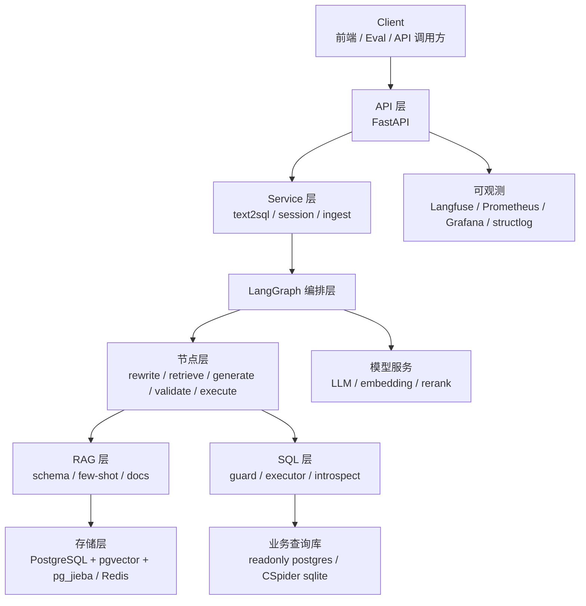
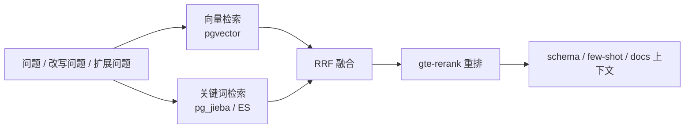

# QueryForge 架构说明

QueryForge 是一个面向生产实践的通用 Text-to-SQL 服务。它把自然语言问题转成安全可执行的 SQL，并围绕准确率、安全性、稳定性和可观测性做工程化设计。

## 总体分层



## 请求主链路

入口在 `app/api/v1/query.py`，核心编排在 `app/services/text2sql.py`。

一次无历史查询的大致流程：

1. API 接收 `question` 和 `db_id`。
2. `run_query` 先检查 Redis 精确缓存。
3. 若语义缓存开启，再检查 pgvector 语义近似缓存。
4. 未命中缓存时进入 LangGraph。
5. LangGraph 完成问题改写、检索、schema linking、SQL 生成、校验、执行和回答生成。
6. 成功结果写回缓存。
7. API 返回 SQL、结果表格、自然语言回答和错误信息。

多轮会话不依赖 LangGraph checkpointer 承载历史，而是以 `chat_message` 表作为历史真相来源。`/sessions/{id}/chat` 读取最近若干轮消息后，通过 `state.history` 注入图中。

## LangGraph 节点职责

| 节点 | 作用 |
| --- | --- |
| `detect_language` | 判断问题语言，记录查询开始日志。 |
| `rewrite` | 根据最近多轮历史改写当前问题。 |
| `expand` | 可选多查询扩展，默认生产稳态关闭。 |
| `retrieve` | 并发检索 schema、few-shot 和业务文档。 |
| `schema_linking` | 将召回 schema 裁剪为可喂给 LLM 的紧凑上下文。 |
| `generate_sql` | 根据问题、schema、few-shot、业务文档上下文生成 SQL。 |
| `human_review_sql` | 可选 HIL 审核节点，基于 `interrupt()` 暂停等待人工确认。 |
| `validate_sql` | 使用 sqlglot 做 SQL Guard，只允许安全 SELECT。 |
| `execute_sql` | 只读执行 SQL，限制超时和最大返回行数。 |
| `self_correct` | 校验或执行失败后回灌错误，触发重新生成。 |
| `format_answer` | 根据 SQL 结果生成自然语言回答。 |
| `error_node` | 检索不到必要上下文时返回可解释失败。 |

## RAG 设计

项目维护三类语料：

| 表 | 内容 | 作用 |
| --- | --- | --- |
| `schema_doc` | 表、列、主外键、可选表说明 | schema linking 和 SQL 生成基础上下文 |
| `fewshot_example` | 自然语言问题与 gold SQL 示例 | 让模型学习 SQL 写法和查询模式 |
| `rag_chunk` | 业务文档切块与 summary | 补充业务规则和指标口径 |

检索流程：



当前实验显示，few-shot 是最稳定的收益来源；query expansion 和业务文档上下文不是稳定正收益，因此默认关闭，建议按库离线 A/B 后再开启。

## SQL 安全与执行

Text-to-SQL 的风险不只在准确率，也在执行安全。

项目采用多层防护：

1. `sqlglot` 解析 SQL。
2. 只允许单条 `SELECT`。
3. 拒绝 DDL / DML / 多语句。
4. 自动注入或限制 `LIMIT`。
5. 生产查询使用独立只读账号。
6. Postgres 执行时使用只读事务和 `statement_timeout`。
7. 执行结果限制最大行数。

推荐生产隔离：

```text
POSTGRES_*         应用元数据 / RAG / 会话 / checkpoint
QUERY_POSTGRES_*   业务查询库，只读账号
```

## 缓存、限流与容错

缓存：

- Redis 精确缓存：`db_id + normalized question`。
- pgvector 语义近似缓存：默认关闭，避免 Text-to-SQL 近似误命中。

限流与并发：

- `RATE_LIMIT_QUERY`：单用户/IP 的 `/query` 限流。
- `RATE_LIMIT_QUERY_GLOBAL`：全局 `/query` 限流。
- `QUERY_MAX_INFLIGHT`：在途查询并发上限。
- `QUERY_INFLIGHT_BACKEND=redis`：生产多实例共享并发计数。
- `LLM_MAX_CONCURRENCY`：限制同时调用 LLM 的数量。
- `DASHSCOPE_MAX_CONCURRENCY`：限制 embedding/rerank 并发。

容错：

- LLM / embedding / rerank 统一走 `retry_async`。
- 外部依赖有 `CircuitBreaker`。
- SQL 执行有超时。
- 校验/执行失败进入自纠错环路。
- API 全局异常处理会将错误分类为 429 / 503 / 500 等友好响应。

## 可观测性

| 工具 | 作用 |
| --- | --- |
| Langfuse | 单条请求 trace、prompt、输出、耗时、token、成本。 |
| Prometheus | 采集 `/metrics/` 暴露的 `qf_*` 指标。 |
| Grafana | 展示 QPS、时延、SQL 成功率、缓存命中率、检索时延。 |
| structlog | 结构化日志，配合 correlation-id 排查单次请求。 |

## 部署建议

本地开发可以用 `make infra-up` 启动 PostgreSQL、Redis、Prometheus、Grafana。

生产建议：

- Docker 容器默认 `APP_WORKERS=1`。
- 横向扩容优先多容器 / 多 Pod。
- 多实例共享 Redis 限流和 inflight 计数。
- 业务查询库必须使用只读账号。
- `APP_ENV=production` 开启启动前配置校验。
- 不在镜像中写死密钥，通过环境变量或密钥系统注入。
